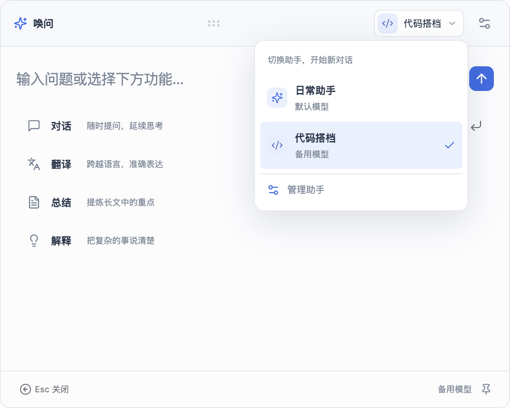
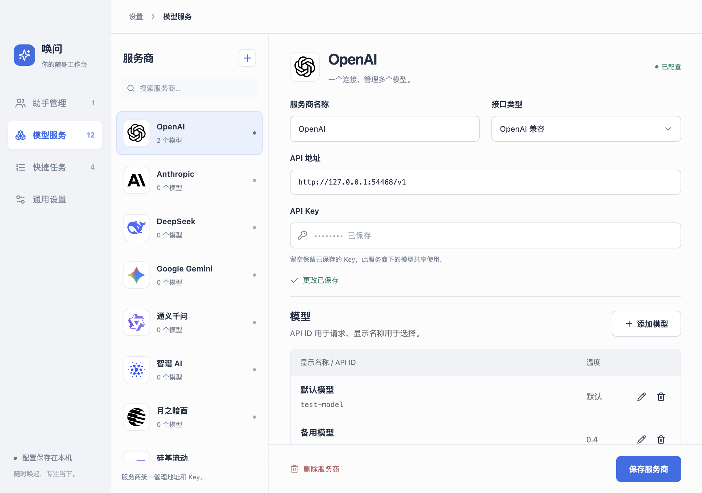
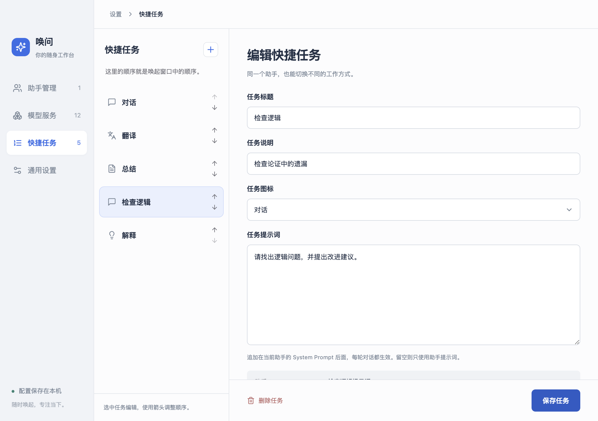

# AskPop · 唤问

**一键唤起，随时提问。**

AskPop 是一个 macOS 桌面 AI 快捷助手。按下快捷键，就能提问、翻译、总结或解释文本；用你自己的 API 配置模型，再为不同任务创建有独立提示词的助手。

交互设计参考 Cherry Studio 的快捷助手。本项目是独立实现，与 Cherry Studio 无隶属关系。

[下载最新版](https://github.com/heureux831/askpop/releases/latest) · [更新记录](CHANGELOG.md) · [反馈问题](https://github.com/heureux831/askpop/issues)

## 预览

### 随时切换助手



### 服务商与多个模型



### 自定义快捷任务



### 独立滚动的思考内容


## 能做什么

- **全局快捷键**：默认 `⌘⇧Space` 唤起，输入框自动聚焦；可在设置中更改。
- **多模型配置**：支持 OpenAI、Anthropic、DeepSeek 和自定义 OpenAI 兼容接口。内置 12 个服务商预设与 SVG 标志，同一服务商共享地址和 Key，可添加多个模型。
- **多个专属助手**：每个助手选择一个模型，设置名称、图标和系统提示词。多个助手可以复用同一个模型连接。
- **随手切换**：对话顶部选择助手；切换会停止旧请求并开始新对话。
- **自定义快捷任务**：对话、翻译、总结等任务可增删、改名、设置说明和提示词，并调整顺序。
- **思考内容**：接口返回的思考文本在固定高度的区域中流式显示，支持独立滚动，开始回答后自动折叠。
- **文本展示**：支持 Markdown、代码块和表格显示。
- **桌面交互**：拖动顶部移动窗口，固定后保持显示；支持剪贴板预览、复制回复、停止生成和浅色／深色主题。

## 安装

1. 在 [Releases](https://github.com/heureux831/askpop/releases/latest) 下载适合 Apple Silicon 的 `AskPop-版本号-arm64.dmg`。
2. 打开 DMG，将 `AskPop.app` 拖入 `Applications`。
3. 启动应用，配置模型和助手，按 `⌘⇧Space` 唤起。

当前提供 **Apple Silicon（M 系列芯片）** 安装包。该版本未做 Developer ID 签名或 Apple 公证；macOS 可能阻止首次打开，请核对下载来源及 Release 中的 SHA-256 校验文件。尚未提供 Intel、Windows 或 Linux 安装包。

从旧版 Quick Assistant 升级时，先退出旧应用，再启动 AskPop；已有模型配置和 API Key 会继续使用。

## 开始使用

### 1. 配置服务商和模型

打开「设置 → 模型服务」。内置 OpenAI、Anthropic、DeepSeek、Google Gemini、通义千问、智谱 AI、月之暗面、硅基流动、OpenRouter、Groq、Mistral AI、Ollama；也可点击 + 添加自定义服务商或同一服务商的另一个账号。

服务商维护 API 地址、接口类型和 API Key。Key 留空保留原值，同一服务商下的模型共享使用。本机 Ollama 无需 Key。Google Gemini 使用 OpenAI 兼容接口。服务商预设是本地目录，不保证账户已开通某个模型。

保存服务商后，点击「添加模型」：

| 字段 | 说明 |
| --- | --- |
| API 模型 ID | 发给服务商的准确模型 ID |
| 显示名称 | 在助手选择器等界面中展示，默认与 API ID 相同 |
| 温度 | 留空使用服务商默认值；OpenAI 兼容接口 0～2，Anthropic 0～1 |

部分推理模型不支持或会忽略温度。当前界面不提供思考模式开关；旧版本已保存的思考设置继续生效，修改 API 模型 ID 时重置为服务商默认行为。

配置结构参考 [Cherry Studio 的服务商与模型配置](https://github.com/CherryHQ/cherry-studio/blob/main/docs/references/provider-model/provider-registry.md)。服务商标志来自 [Lobe Icons](https://github.com/lobehub/lobe-icons)，见 [第三方许可证](THIRD_PARTY_NOTICES.md)。

### 2. 创建助手

打开「助手管理」，从按服务商分组的列表中选择模型，再配置 System Prompt。例如：

| 助手 | 提示词示例 |
| --- | --- |
| 日常问答 | 用简洁、清晰的中文回答；不确定的信息请明确说明。 |
| 代码搭档 | 先分析问题，再给出可执行的方案和必要代码，说明重要假设。 |
| 写作编辑 | 保留原文含义和语气，改善表达，直接输出润色后的文本。 |

界面提供提示词模板，也可以完整自定义。初始「日常助手」的提示词为空，使用模型默认行为。

被助手引用的模型不能直接删除；请先更换相关助手的模型。切换编辑对象时，未保存的更改会有提醒。

### 3. 自定义快捷任务

在「快捷任务」中添加或删除任务，设置标题、说明、图标和任务提示词，用上下箭头调整顺序，点击「保存任务」后会同步到唤起窗口。

请求按 **助手 System Prompt → 任务提示词** 的顺序拼接，每轮对话都会使用；用户输入保持原样。默认「对话」任务提示词为空。至少保留一个任务。

### 4. 唤起并提问

| 操作 | 行为 |
| --- | --- |
| `⌘⇧Space` | 显示／隐藏窗口，可自定义 |
| `Enter` | 发送输入，或执行当前选中的快捷功能 |
| `↑` / `↓` | 按自定义顺序选择快捷任务 |
| `Esc` | 生成时停止；完成后返回首页；首页隐藏窗口 |
| 拖动顶部空白处或把手 | 移动窗口 |
| 点击固定按钮 | 切换失焦后是否隐藏 |
| 点击顶部助手按钮 | 切换助手并开始新对话 |

首页会显示剪贴板预览。预览中的文本会随该会话的首条消息发送；不希望带入时，请先点击关闭，或在输入框为空时按 `Backspace` 清除预览。

接口返回思考内容时，会显示 144px 高的小字矩形区域。可上下滚动查看；滚动到较早内容后不强制跳回底部。开始输出答案、停止或出错后自动折叠，点击「思考过程」可展开。思考文本不会混入复制的答案或后续聊天历史。

## 数据与隐私

- API 请求由本机直接发送到你配置的服务商；服务商可能按自己的政策记录请求并收取费用。
- 模型、助手、提示词及通用设置保存在本机。API Key 单独保存在本地 SQLite 数据库 `secrets.sqlite`，不回传到设置页面，保存新 Key 不依赖系统钥匙串。
- SQLite 中的 API Key 不额外加密；数据库文件权限为 `0600`（仅文件所有者可读写）。备份应用数据目录会包含 Key，请妥善保管。
- 为兼容旧版，应用沿用 `~/Library/Application Support/quick-assistant-app/` 配置目录及内部应用标识。
- 首次写入多模型配置时备份为 `config.json.v1.bak`；首次写入服务商结构时备份为 `config.json.v3.bak`。旧模型的名称、助手引用保留，不自动合并不同账号。
- 读取旧版 `secrets.bin` / `model-secrets/*.bin` 时，如果系统可解密，会自动迁移到 SQLite，并保留旧文件。旧 Key 无法解密时可重新填写；之后读取新 Key 不再依赖钥匙串。删除凭据会清理对应旧文件，并阻止旧备份重新导入。
- 当前聊天记录只保留在内存中，未提供持久化聊天历史。

## 本地开发

技术栈：Electron 33、React 18、TypeScript、Vite、Tailwind CSS、AI SDK。

本机验证环境为 Node.js 26、pnpm 10 和 macOS Apple Silicon。

安装依赖时会为 Electron 重建 SQLite 原生模块；单元测试也使用 Electron 的 Node 运行时，确保测试与应用使用相同的原生模块 ABI。

```sh
git clone https://github.com/heureux831/askpop.git
cd askpop
pnpm install --frozen-lockfile
pnpm dev
```

```sh
pnpm typecheck     # TypeScript 检查
pnpm test          # 单元测试
pnpm test:e2e      # 构建并运行真实 Electron 端到端验收
pnpm package       # 构建 .app，并检查包内运行依赖
pnpm dist          # 构建 .app + .dmg，并检查包内运行依赖
```

端到端测试使用临时配置与本地模拟 SSE 服务，不需要真实 API Key、不调用付费 API。测试会恢复剪贴板并清除临时配置。测试覆盖服务商共享 Key、API ID 与显示名称分离、温度、分组选模、任务排序与提示词拼接、思考区域高度和滚动稳定性、重启恢复、主题及快捷键冲突。

macOS arm64 构建产物位于：

```text
dist/mac-arm64/AskPop.app
dist/AskPop-0.4.0-arm64.dmg
```

## 项目结构

```text
src/main/       窗口、全局快捷键、配置与凭据存储、聊天请求、IPC
src/preload/    主进程与界面之间的桥接 API
src/renderer/   快捷窗口、设置工作台、共享组件和样式
src/shared/     配置类型与 IPC 定义
e2e/            Electron 端到端测试
scripts/        打包产物检查
docs/           设计与验收记录
```

当前不包含 Agent、工具调用、MCP、自动拉取模型列表或自动更新。历史设计文档保留用于追溯，当前行为以代码、此 README 和[最新功能验收记录](docs/acceptance-provider-workspace-2026-09-24.md)为准。
