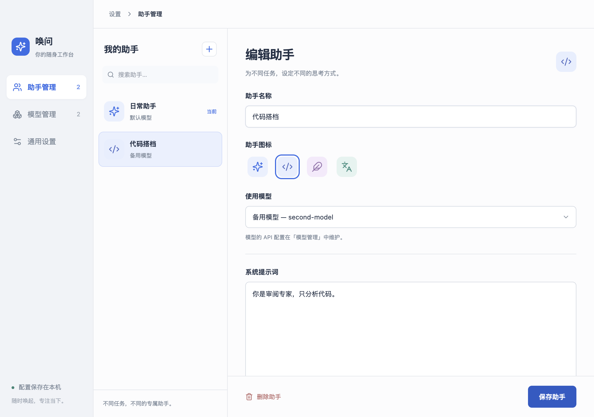

# AskPop · 唤问

**一键唤起，随时提问。**

AskPop 是一个 macOS 桌面 AI 快捷助手。按下快捷键，就能提问、翻译、总结或解释文本；用你自己的 API 配置模型，再为不同任务创建有独立提示词的助手。

交互设计参考 Cherry Studio 的快捷助手。本项目是独立实现，与 Cherry Studio 无隶属关系。

[下载最新版](https://github.com/heureux831/askpop/releases/latest) · [更新记录](CHANGELOG.md) · [反馈问题](https://github.com/heureux831/askpop/issues)

## 预览

### 随时切换助手


### 模型与助手，分开管理



## 能做什么

- **全局快捷键**：默认 `⌘⇧Space` 唤起，输入框自动聚焦；可在设置中更改。
- **多模型配置**：支持 OpenAI、Anthropic、DeepSeek 和自定义 OpenAI 兼容接口。每个配置独立维护模型 ID、API 地址及 Key。
- **多个专属助手**：每个助手选择一个模型，设置名称、图标和系统提示词。多个助手可以复用同一个模型连接。
- **随手切换**：对话顶部选择助手；切换会停止旧请求并开始新对话。
- **日常工具**：流式对话、中文翻译、文本总结、通俗解释，以及 Markdown、代码块和表格显示。
- **桌面交互**：拖动顶部移动窗口，固定后保持显示；支持剪贴板预览、复制回复、停止生成和浅色／深色主题。

## 安装

1. 在 [Releases](https://github.com/heureux831/askpop/releases/latest) 下载适合 Apple Silicon 的 `AskPop-版本号-arm64.dmg`。
2. 打开 DMG，将 `AskPop.app` 拖入 `Applications`。
3. 启动应用，配置模型和助手，按 `⌘⇧Space` 唤起。

当前提供 **Apple Silicon（M 系列芯片）** 安装包。该版本未做 Developer ID 签名或 Apple 公证；macOS 可能阻止首次打开，请核对下载来源及 Release 中的 SHA-256 校验文件。尚未提供 Intel、Windows 或 Linux 安装包。

从旧版 Quick Assistant 升级时，先退出旧应用，再启动 AskPop；已有模型配置和 API Key 会继续使用。

## 开始使用

### 1. 连接模型

打开「设置 → 模型管理」，添加一个模型配置：

| 字段 | 说明 |
| --- | --- |
| 配置名称 | 便于辨认，例如「DeepSeek 日常」 |
| 供应商 | OpenAI、Anthropic、DeepSeek 或 Custom |
| 模型 ID | 服务商提供的准确模型名称，也可选择预设 |
| API 地址 | 官方或兼容接口地址，通常以 `/v1` 结尾 |
| API Key | 服务商提供的密钥；编辑已有配置时留空保留原 Key |

模型预设记录模型 ID、接口兼容方式与支持的思考参数。目前包含 OpenAI、Anthropic、DeepSeek 共 14 个常用型号；实际可用模型及权限以你的服务商账户为准。

**深度思考**开关位于模型设置中。关闭时优先快速回答；开启后可按模型能力选择思考强度（OpenAI、DeepSeek、Claude 4.6），或设置思考 Token 预算（Claude 4.5）。部分推理模型无法完全关闭，普通模型或未知模型不会显示可操作的开关。

旧配置默认沿用服务商行为，不会因升级自动关闭思考。点击开关即可覆盖默认值，也可以「恢复默认」。DeepSeek 官方地址即使配置为 Custom，也能识别 `deepseek-v4-flash` 别名。

自定义代理可选择兼容的参数预设，再填写实际模型别名；选择预设不会更改自定义 API 地址。未知接口不猜测思考参数，须由你选择兼容预设。预设是离线目录，当前不自动同步模型列表。

设计参考 [Pi 的模型目录与能力配置](https://github.com/badlogic/pi-mono/blob/main/packages/coding-agent/docs/models.md)和 [OpenCode 的模型选项与 variants](https://opencode.ai/docs/models/)。

### 2. 创建助手

打开「助手管理」，创建助手并选择模型。例如：

| 助手 | 提示词示例 |
| --- | --- |
| 日常问答 | 用简洁、清晰的中文回答；不确定的信息请明确说明。 |
| 代码搭档 | 先分析问题，再给出可执行的方案和必要代码，说明重要假设。 |
| 写作编辑 | 保留原文含义和语气，改善表达，直接输出润色后的文本。 |

界面提供提示词模板，也可以完整自定义。初始「日常助手」的提示词为空，使用模型默认行为。

被助手引用的模型不能直接删除；请先更换相关助手的模型。切换编辑对象时，未保存的更改会有提醒。

### 3. 唤起并提问

| 操作 | 行为 |
| --- | --- |
| `⌘⇧Space` | 显示／隐藏窗口，可自定义 |
| `Enter` | 发送输入，或执行当前选中的快捷功能 |
| `↑` / `↓` | 首页选择对话、翻译、总结、解释 |
| `Esc` | 生成时停止；完成后返回首页；首页隐藏窗口 |
| 拖动顶部空白处或把手 | 移动窗口 |
| 点击固定按钮 | 切换失焦后是否隐藏 |
| 点击顶部助手按钮 | 切换助手并开始新对话 |

首页会显示剪贴板预览。预览中的文本会随该会话的首条消息发送；不希望带入时，请先点击关闭，或在输入框为空时按 `Backspace` 清除预览。

## 数据与隐私

- API 请求由本机直接发送到你配置的服务商；服务商可能按自己的政策记录请求并收取费用。
- 模型、助手、提示词及通用设置保存在本机。API Key 使用 Electron `safeStorage` 加密保存，不回传到设置页面。
- 为兼容旧版，应用沿用 `~/Library/Application Support/quick-assistant-app/` 配置目录及内部应用标识。
- 首次写入多模型配置时会备份旧配置为 `config.json.v1.bak`。
- 当前聊天记录只保留在内存中，未提供持久化聊天历史。

## 本地开发

技术栈：Electron 33、React 18、TypeScript、Vite、Tailwind CSS、AI SDK。

本机验证环境为 Node.js 26、pnpm 10 和 macOS Apple Silicon。

```sh
git clone https://github.com/heureux831/askpop.git
cd askpop
pnpm install --frozen-lockfile
pnpm dev
```

```sh
pnpm typecheck     # TypeScript 检查
pnpm test          # 单元测试
pnpm test:e2e      # 构建并运行真实 Electron 端到端验收
pnpm package       # 构建 .app，并检查包内运行依赖
pnpm dist          # 构建 .app + .dmg，并检查包内运行依赖
```

端到端测试使用临时配置与本地模拟 SSE 服务，不需要真实 API Key、不调用付费 API。测试会恢复剪贴板并清除临时配置。测试覆盖多模型及独立 Key、助手提示词、会话隔离、重启恢复、主题、快捷键冲突，以及基础对话与文本工具。

macOS arm64 构建产物位于：

```text
dist/mac-arm64/AskPop.app
dist/AskPop-0.3.0-arm64.dmg
```

## 项目结构

```text
src/main/       窗口、全局快捷键、配置与加密、聊天请求、IPC
src/preload/    主进程与界面之间的桥接 API
src/renderer/   快捷窗口、设置工作台、共享组件和样式
src/shared/     配置类型与 IPC 定义
e2e/            Electron 端到端测试
scripts/        打包产物检查
docs/           设计与验收记录
```

当前不包含 Agent、工具调用、MCP、自动拉取模型列表或自动更新。历史设计文档保留用于追溯，当前行为以代码、此 README 和[最新功能验收记录](docs/acceptance-assistants-2026-09-23.md)为准。
